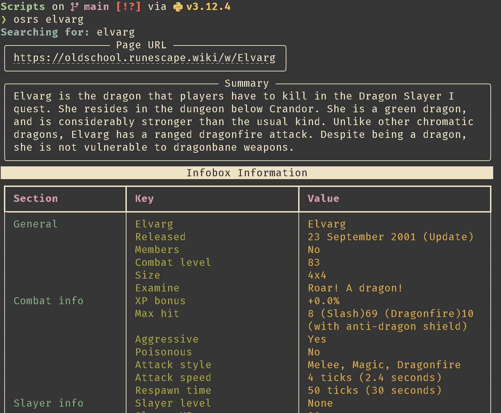

# OSRS Wiki TUI

This Python script allows you to quickly fetch and display information from the Old School RuneScape (OSRS) Wiki directly in your terminal. It provides a summary, page URL, and formatted infobox data for any searchable item or entity on the wiki.



## Features

- Fetches data from the OSRS Wiki based on user input
- Displays page URL, summary, and formatted infobox information
- Presents data in a visually appealing table format in the terminal
- Handles various types of infoboxes (monsters, items, etc.)

## Requirements

- Python 3.6+
- pip (Python package installer)
- Linux/MacOS (haven't tested on Windows yet)

## Installation

1. Clone this repository:
```
git clone https://github.com/yourusername/osrs-wiki-scraper.git
cd osrs-wiki-scraper
```
2. Install the required packages:
```
pip install -r requirements.txt
```
## Usage

Run the script from the command line, providing your search term as an argument:
```
python osrs.py <search term>
```
> Example
```
python osrs.py rat
```
## Calling from terminal/CLI (RECOMMENDED)
### Linux/MacOS
1. Configure your .zshrc, .bashrc or any other config file your terminal uses 
```
echo 'alias osrs="~/path/to/osrs_wiki.py"' >> ~/.zshrc
source ~/.zshrc
```
^^ Replace `~/path/to/osrs_wiki.py` with the actual path to your script.

2. Set osrs.py to be executabe with
```
chmod + x <~/path/to/osrs_wiki.py>
```

Now you can just run `osrs <thing>`, i.e: `osrs highwayman`

## Dependencies

This script relies on the following Python libraries:
- requests
- beautifulsoup4
- rich

These are listed in the `requirements.txt` file and can be installed using pip.

## Contributing

Contributions, issues, and feature requests are welcome. Feel free to check the [issues page](https://github.com/aptrinh/osrs-wiki-tui/issues) if you want to contribute.

## License

This project is licensed under the MIT License - see the [LICENSE](LICENSE) file for details.

## Acknowledgments

- [Old School RuneScape Wiki](https://osrs.wiki) for providing the data
- The developers of BeautifulSoup and Rich for their excellent libraries

## Disclaimer

*This tool is fan-made and not affiliated with Jagex or the Old School RuneScape Wiki. Use responsibly and in accordance with the Wiki's terms of service.*